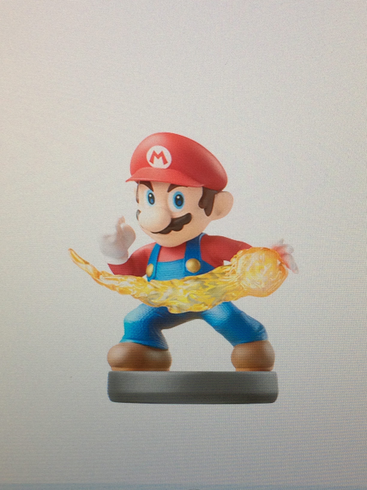

Amiibo
======

What are they?
--------------

Amiibo are a series of Nintendo character toys that interact with multiple games on the Wii U and 3DS. These figurines were first released in November 21, 2014 in the United States. Amiibo was announced in May 8, 2014, and they were unnamed when they were first revealed. They can store a character's unique data, such as a build in a particular game or be used as a key to unlock costumes or features. They can evolve as they are used in games and as new data is saved. They can unlock features in multiple games. Click on the link to see a list of `amiibos`_ . 

.. _amiibos: http://www.nintendo.com/amiibo/line-up

+----------------------------------------------------------+
|Games that work with it                                   |
+==========================================================+
|*Super Smash Bros. for Wii U/Super Smash Bros. for 3DS*   |
+----------------------------------------------------------+
|*Mario Kart 8*                                            |
+----------------------------------------------------------+
|*Yoshi’s Wooly World*                                     |
+----------------------------------------------------------+
|*Mario Party 10*                                          |
+----------------------------------------------------------+
|*Captain Toad Treasure Tracker*                           |
+----------------------------------------------------------+
|*Hyrule Warriors*                                         |
+----------------------------------------------------------+
|*One Piece: Super Grand Battle! X*                        |
+----------------------------------------------------------+
|*Kirby and the Rainbow Curse*                             |
+----------------------------------------------------------+
|*Splatoon*                                                |
+----------------------------------------------------------+
|*Super Mario Maker*                                       |
+----------------------------------------------------------+
|*Shovel Knight*                                           |
+----------------------------------------------------------+
|*Ace Combat 3D: Cross Rumble Plus*                        |
+----------------------------------------------------------+
|*Code Name S.T.E.A.M.*                                    |
+----------------------------------------------------------+
|*Animal Crossing: Happy Home Designer*                    |
+----------------------------------------------------------+

Systems
-------

The Wii U GamePad is used for amiibos. The Nintendo 2DS and 3DS require a separate peripheral. The New 3DS has an NFC feature built-in and it functions just like the Wii U GamePad, and no peripheral is needed.