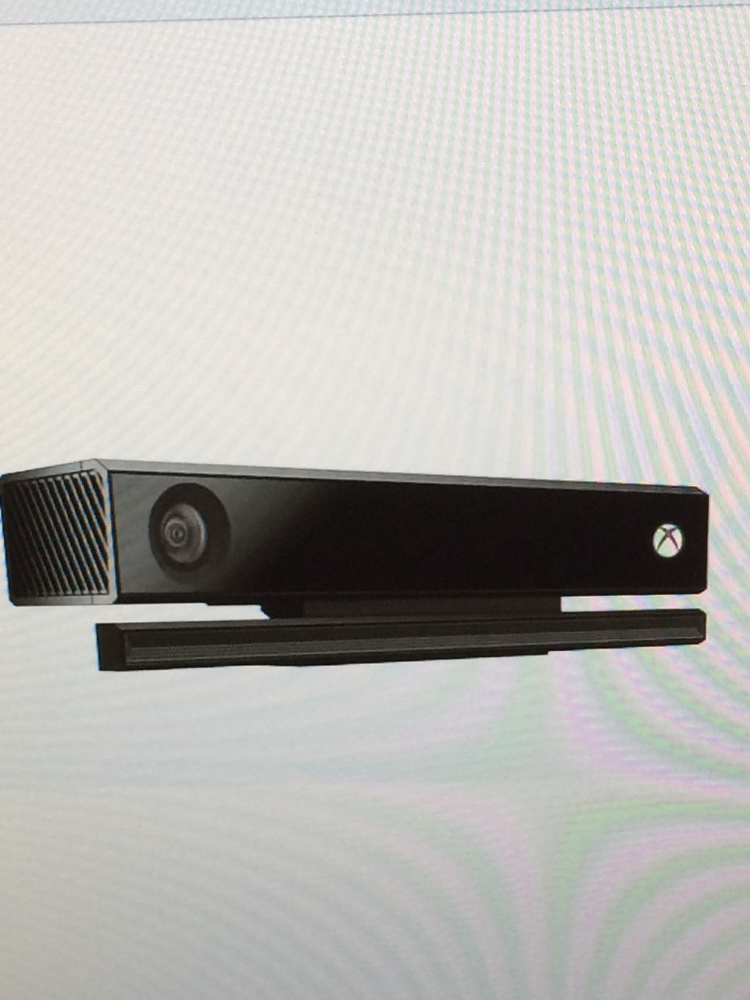

Xbox Kinect
===========

What is the Kinect?
-------------------

Kinect is a line of motion sensing input devices made by Microsoft for the Xbox 360 and Xbox One video game consoles and Windows PCs. The Kinect is based around a webcam-style add-on peripheral, and it enables users to control and interact with their console or computer without the need for a game controller. It does this through a natural user interface using gestures and spoken commands. It was first introduced in November 2010 as an attempt to broaden Xbox 360's audience beyond its typical gamer base. A version for Windows was released on February 1, 2012. The Kinect competes with Wii Remote Plus for Wii and Wii U, PlayStation Move/PlayStation Eye for PlayStation 3, and PlayStation Camera for PlayStation 4, because they both use motion sensing controllers. 

History
-------

Kinect was first announced on June 1, 2009 at E3 2009 under the code name "Project Natal". It was rumored that the launch of Project Natal would go together with the release of a new Xbox 360 console. Kinect was even referred to as a "new Xbox" by the CEO of Microsoft Steve Ballmer. During Kinect's development, project team members experimentally modified many games to Kinect-based control schemes to help evaluate usability.