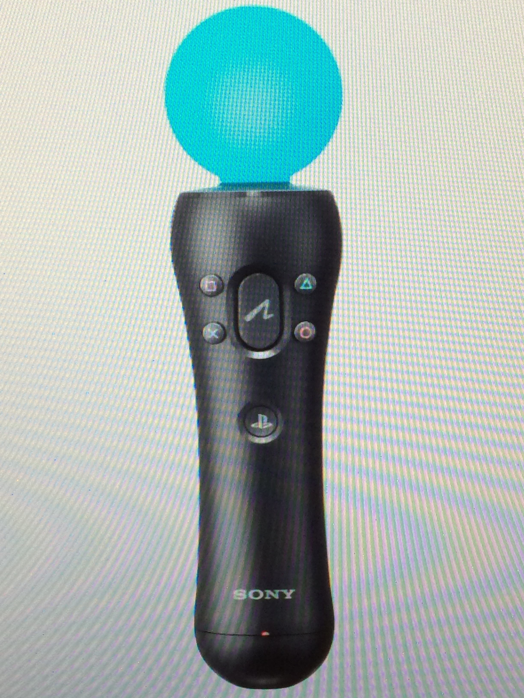

PlayStation Move
================

What is the PlayStation Move?
-----------------------------

The PlayStation Move is a handheld controller with a glowing orb on the top that works in conjunction with the PlayStation Eye camera to track video game movements like punches, sword strokes, and tennis racket swings. It uses works in conjunction with the PlayStation Eye camera to track video game movements like punches, sword strokes, and tennis racket swings. It also has regular controller buttons for shooting games that require you to pull a trigger. The PlayStation move was first released for the PlayStation 3, and it competes with the Wii Remote Plus and Kinect motion controllers introduced with the Wii and Xbox 360 home consoles, respectively. Although PlayStation Move was introduced on the pre-existing PlayStation 3 console, Sony stated prior to release that it was treating Move's debut as its own major "platform launch", with an aggressive marketing campaign to support it. In 2013, Sony unveiled the PlayStation 4, revealing that the console will support PlayStation Move, providing greater tracking precision via the PlayStation Camera, a depth-sensing stereo camera.

The PlayStation Move motion controller features an orb at the head which can glow in any of a full range of colors using RGB light-emitting diodes (LEDs). Based on the colors in the user environment captured by the camera, the system dynamically selects an orb color that can be distinguished from the rest of the scene. The colored light serves as an active marker, the position of which can be tracked along the image plane by the camera.
