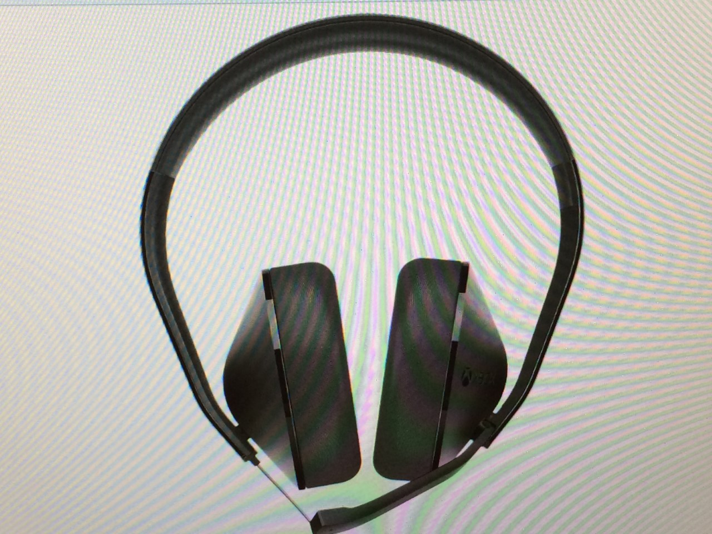

Xbox Headset
============

What is the Xbox Wireless Headset?
----------------------------------

The Xbox 360 Wireless Headset is a wireless headset designed for the Xbox 360 and Xbox Live that was manufactured by Microsoft. It is used for in game voice chat, private chat, audio for video chat and in game voice recognition. The headset fits over either ear and comes with two sizes of removable earloops for a better fit. It uses the same 2.4 GHz wireless technology as the Xbox 360 Wireless Controller, so it will work within 30 feet of the console. It can achieve up to eight hours of battery life per charge, with an AC wall adapter or a USB DC charger for recharging. The headset is also compatible for use with a PC via the Microsoft Wireless Receiver. Up to 4 wireless headsets and wireless controllers can be used in conjunction at any one time. The headset can be used with or without a controller. The headset also produces various beeps to signal different actions and give messages to the user.

Issues
------

Some problems have been reported by users of the headsets. One issue reported is that the headset may not be able to be used with some controllers. Other users have reported the headset losing its connection with the console during use.