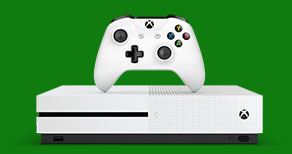

Xbox One
========

.. toctree::
   :maxdepth: 2

The Dream 
----------

    The *Xbox One* was released on November 22nd 2013 and is still kicking strong
    with amazing sales. The Xbox one features a sleek design with some amazing
    software and amazing games to back it up. I would like to say that having
    a TV tuner built into the systems is a really nice feature, especially
    since the idea of an all in one systems is mostly what people are wanting
    to have now days. The idea of this one box does everything I want and
    more is a pretty good deal. My favorite feature with this built in
    TV tuner is the fact that the systems follows the idea that windows 8
    and 10 use with the snap apps. You can be playing games on half of
    your TV screen and the other half can be used to watch tonight’s
    basketball game, keeping you on track with all of our favorite
    teams and games.

    Although the **Xbox One** is a really nice system I do find it really concerning
    for how loud the fans in the system are and how much heat the system produces.
    This is really scary because they system does it automatically to keep
    it cool so my question is why is the systems heating up so quickly and
    how long will the system last with that kind of heat?

                                =====  =======   =========
                                Fun    Family?   Awesome?!
                                =====  =======   =========
                                True   Kind of   True
                                =====  =======   =========

