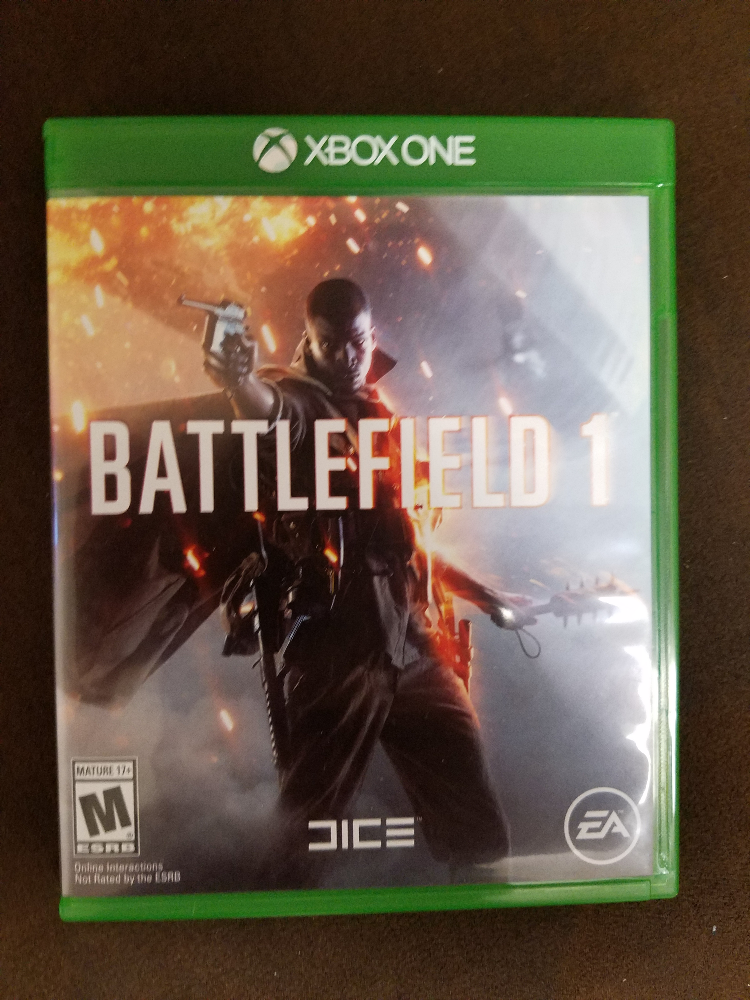

Battlefield 1
==========================================

Contents:

.. toctree::
   :maxdepth: 2

About
------

Battlefield 1 is a first person shooter game based on World War 1, where you 
get to use the innovative and modern weaponry and vehicles from that time 
period. You get to fight across the land, air, and sea. There are 2 different 
game modes within Battlefield 1, single player and multiplayer. Within the 2
game modes they have multiple game modes as well.

For single player, you battle as different people in the war in different
scenarios. There are 5 different scenarios, Friends in High Places, Nothing is 
Written, Through Mud and Blood, Avanti Savoia, and The Runner.

In the multiplayer game mode there are 6 different modes. There are objective
game modes and straight up Team Deathmatch. The objective modes are War 
Pigeons, Rush, Operations, Domination, and Conquest.

There are 10 different maps for the game, some being downloadable and some 
preloaded on the game already. The maps are Giant's Shadow, Ballroom Blitz, 
Argonne Forest, Fao Fortress, Suez, The St. Quentin Scra, Sinai Desert, Amiens,
Monte Grappa, and Empire's Edge.

There are 6 different classes you can play with in the multiplayer game mode.
There's the class that can blow up cars, the Assault class, there's the class 
that has nearly unlimited ammo, the Support class, there's the Medic class that
can keep your teammates alive, there's a class that can take down enemies from
a far distance, the Scout class, and then there's the classes that can drive 
the tank, the Tanker class, or fly the planes, The Pilot class. You can pick
the class that fits your fighting style or switch during the match if you want
to try them all.

With the ever changing weather and destruction the battles are never on the 
same landscape.

This game was created by Electronic Arts(EA) Inc.

+------------------+
|*Availability*    |
+==================+
|Playstation 4     |
+------------------+
|Xbox 1            |
+------------------+
|PC                |
+------------------+