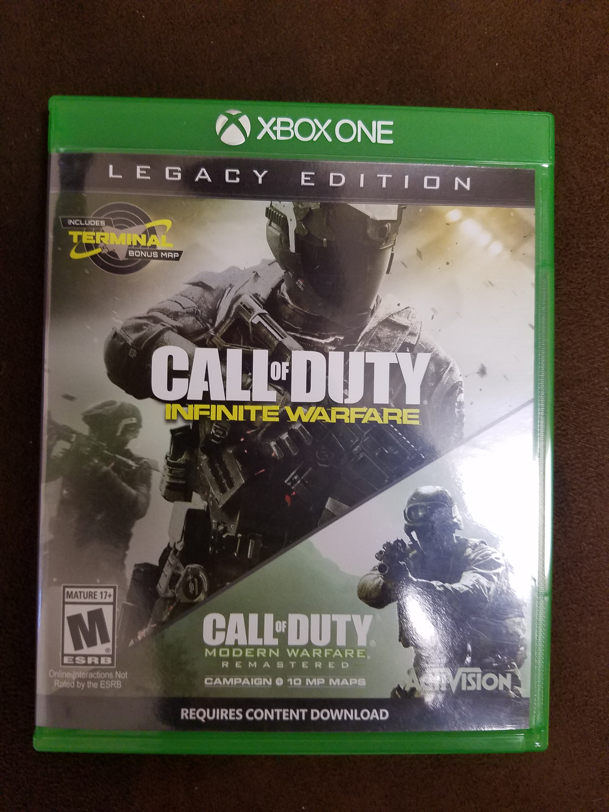

Call of Duty: Infinite Warfare
==========================================

Contents:

.. toctree::
   :maxdepth: 2

About
------

Call of Duty: Infinite Warfare is a first person shooter game set in the
future. It gives you a whole new user experience by giving the user 
the experience of future warfare. There are 3 different game modes, Campaign,
Multiplayer, and Zombies.

In the campaign you are acting as Captain Reyes, who is a Tier 1 Special Ops
pilot who was turned commander, and you must lead your remaining forces against
a never ending, unforgiving enemy. While fighting in the extreme environments of
deadly space.

In the Multiplayer game mode, you are fighting all around the vast solar system.

While the rest of the game is set in the future, the Zombie game mode is set
in the 1980s. While in the 1980s you are fighting in an amusement park with
multiple rides, an awesome arcade, and even a working rollercoaster. What
good is an 80s theme without a rad 80s soundtrack?

This game was created by Activision.

Availablity
------------
* PS4
* Xbox 1
* PC