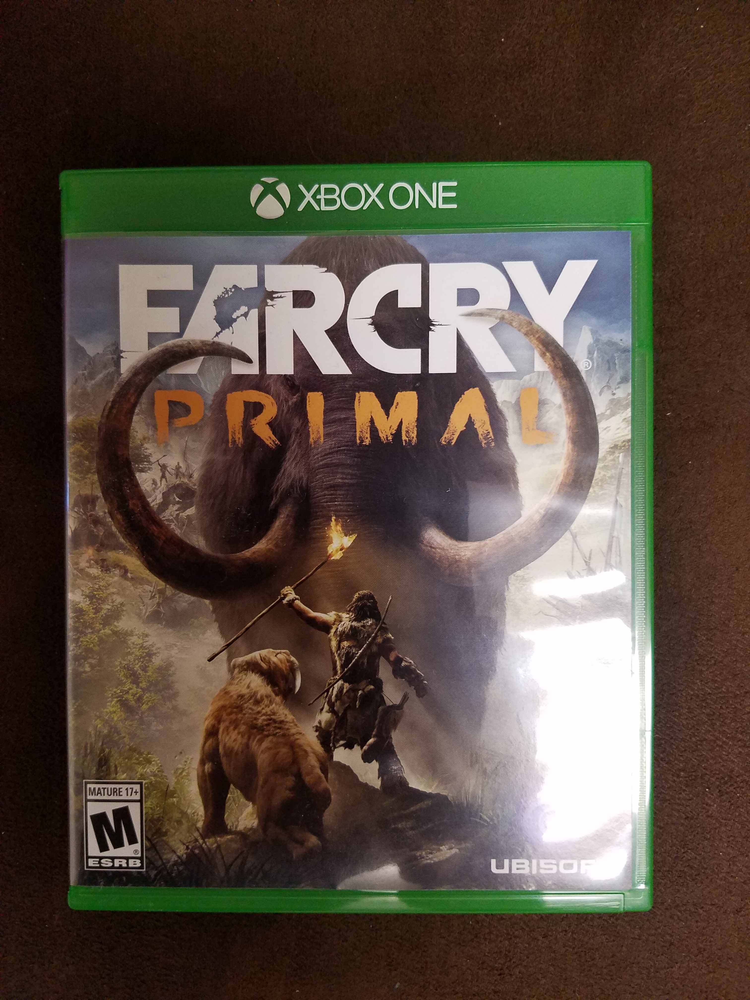

Far Cry Primal
==========================================

Contents:

.. toctree::
   :maxdepth: 2

About
------
Far Cry Primal is a first person role playing game set in the stone age when 
humans were bottom of the food chain. Constantly being in extreme danger, 
either by the great mammoths or sabretooth tigers that rule the world, and 
limitless adventure. Being the last survivor of your hunting group, killed 
while trying to bring down a mammoth, you must learn to craft a deadly arsenal.
You must also watch your back at all times to watch out for fierce predators
and enemy tribes of Oros and become the apex predator.

You play as Takkar, a wise hunter, with one goal in mind, to survive. Along
with surviving you must also grow your tribe and expnad and perfect your skills
to lead your people. But don't worry you're not alone, along the way you 
perfect your skill of taming beasts. Being able to tame deadly beasts,
sabretooth tigers, bears, and cave lions to name a few, to become your ally
and always have your back in battle. You can also always have an overhead view
with your owl, who you can call upon to see whats up ahead and who may be
waiting for you over the next hill. You meet many people along the way who
help you over come the dangers of Oros.

This game was created by Ubisoft.

+------------------+
|*Availability*    |
+==================+
|Playstation 4     |
+------------------+
|Xbox 1            |
+------------------+
|PC                |
+------------------+