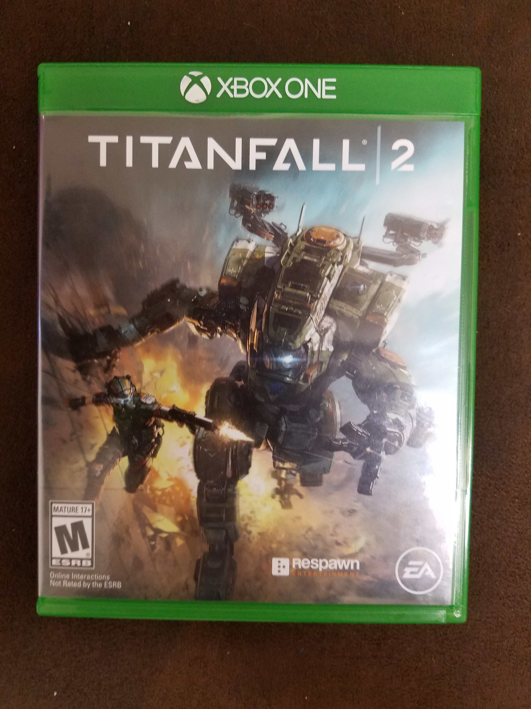

Titanfall 2
==========================================

.. toctree::
   :maxdepth: 2

About
------

Titanfall 2 is a first person shooter that is set in the future. It's a game
where you, the pilot, and your titan become one. Titanfall 2 has 2 different 
game modes, single player and multiplayer. 

In the single player game mode you get to explore the unique and dynamic
relationship between you as the pilot and your titan. In the multiplayer 
game mode you get to have an experience that number one, with it being so fast
paced and deep into the Titanfall experience. You also have the option to team
up with your friends in the multiplayer game mode so you can demolish people 
together.

In multiplayer you can customize your pilot with different tacticals. There are
7 different tacticals you can equip you pilot with, Grapple, Pulse Blade, Holo
Pilot, Stim, Cloak, Phase Shift, and A-wall. Each tactical has its own
abilities. 

You can also customize your Titan in multiplayer. There are 6 different Titans
to choose from and customize. Theres Northstar, Ronin, Scorch, Ion, Legion,
and Tone.

+----------+--------------------------------------------------------------------------------------+------------------------+
|Titan Name|Ability                                                                               |Primary Weapon          |
+==========+======================================================================================+========================+
|Scorch    |Manipulates fire as its primary source of defensive and offensive abilities           | T-203 Thermite Launcher|
+----------+--------------------------------------------------------------------------------------+------------------------+
|Northstar |Master of both flight and precision kills, A sniper who can fly                       |Plasma Railgun          |
+----------+--------------------------------------------------------------------------------------+------------------------+
|Ronin     |Loves getting up close with its samurai vibe, and quick to get in and out tactice     |Leadwall Shotgun        |
+----------+--------------------------------------------------------------------------------------+------------------------+
|Ion       |Uses its energy management abilities to divert power between its three weapons systems|Splitter Rifle          |
+----------+--------------------------------------------------------------------------------------+------------------------+
|Legion    |Utilizes an assortment of ballistic abilities focusing on defense and control         |Predator Cannon         |
+----------+--------------------------------------------------------------------------------------+------------------------+
|Tone      |Accurately laying waste to enemies both efficiently - and explosively                 |Tracker 40mm            |
+----------+--------------------------------------------------------------------------------------+------------------------+

This game was created by Electronic Arts(EA) Inc.

+------------------+
|*Availability*    |
+==================+
|Playstation 4     |
+------------------+
|Xbox 1            |
+------------------+
|PC                |
+------------------+